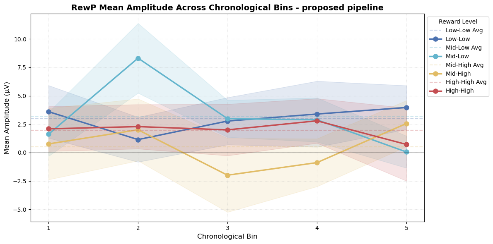

# Introduction

The original paper reported that RewP amplitude is reduced in the high-value task relative to the mid-value task for high-value cues, interpreted as evidence that ACC evaluates trial-level outcomes relative to average task value. If this modulation reflects a learned representation of task value that strengthens with experience, RewP amplitude should change across the session as participants accumulate evidence about the reward environment. Specifically, we ask whether the RewP decreases over time in the High-High condition, where the discrepancy between trial reward and average task value diminishes as the task value estimate stabilizes, while remaining relatively stable in lower-value conditions. This constitutes an exploratory secondary analysis not conducted in the original paper.

# Methods

Trials were divided into five chronological bins of approximately equal size, separately for each task group (low-value, mid-value, high-value). Binning was performed by trial count rather than time, since the duration of individual trials varies across participants and conditions. Corresponding bins across task groups were then concatenated, such that bin 1 contains the earliest trials from all three tasks and bin 5 contains the latest. RewP amplitude was extracted per participant per bin per condition using the same procedure as the main analysis.

**Statistics** Two complementary analyses were conducted. First, pairwise t-tests compared bin 1 against bin 5 for each condition separately, testing whether RewP amplitude at the start of the session differed from the end. Bonferroni correction was applied across the four comparisons to control the familywise error rate. Second, a two-way repeated-measures ANOVA with factors Condition (Low-Low, Mid-Low, Mid-High, High-High) and Bin (1–5) was fitted to test for main effects and the Condition × Bin interaction. Greenhouse-Geisser correction was applied to all effects given the likelihood of sphericity violations with five bin levels. One participant was excluded from the ANOVA due to a missing Mid-High observation in one bin. The t-tests used all available participants with NaN pairs removed.

# Results

## Bin counts summary

```{python}
#| echo: false
import pandas as pd
from IPython.display import Markdown

df_bin_summary = pd.read_csv('../output_mne/stats/bin_counts_summary_prop_learner.csv', index_col=0)
df_ttest = pd.read_csv('../output_mne/stats/ttest_binning_prop_learner.csv', index_col=0)
df_anova = pd.read_csv('../output_mne/stats/anova_binning_prop_learner.csv', index_col=0)
```

{#fig-bin-prop}

```{python}
#| echo: false
Markdown(df_bin_summary.to_markdown())
```

: Trial counts per chronological bin and condition {#tbl-bin-counts}

## Pairwise t-tests (Bin 1 vs Bin 5)

```{python}
#| echo: false
# Round and select relevant columns
df_ttest_display = df_ttest[['t', 'p', 'd', 'p_corrected']].round(3)
Markdown(df_ttest_display.to_markdown())
```

: Paired t-test results comparing first and last bin per condition, with Bonferroni correction {#tbl-ttest}

## Repeated-Measures ANOVA

```{python}
#| echo: false
df_anova_display = df_anova.round(3)
Markdown(df_anova_display.to_markdown())
```

: Repeated-measures ANOVA with Greenhouse-Geisser correction {#tbl-anova}

# Discussion

No significant effects were observed in either analysis. The pairwise t-tests found no evidence that RewP amplitude in bin 1 differed from bin 5 in any condition (p \> 0.56, \|d\| \< 0.23). The repeated-measure ANOVA yielded no significant main effect of Condition (F = 1.59, p = 0.25), Bin (F=0.74, p = 0.54), or Condition x Bin interaction (F = 1.33, p = 0.30).

The results do not support the hypothesis that RewP amplitude in the High-High condition decreases over while remains stable in other conditions. In contrast, RewP appears to be relatively stable across the chronological bins. Same analysis is done on the original pipeline, yet no statistically significant results were found either so was omitted here.

Admittedly, the current analysis is exploratory and is prone to many limitations. First of all, given that original data size was far from sufficiant, binning further divides it into smaller chunks and thus could hardly yield any significant result. Second, a warning is raised when calculating RM-ANOVA with Greenhouse-Geisser correction: `Epsilon values might be innaccurate in two-way repeated measures design where each factor has more than 2 levels.`. Therefore, the Greenhouse-Geisser corrected p-value for the Condition-Bin interaction should be treated with caution (need to check).

Future work would benefit from a larger sample size. Single-trial regression is a potential alternative that avoids averaging within bins and may offer greater statistical power.