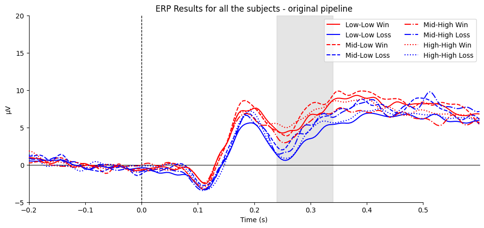
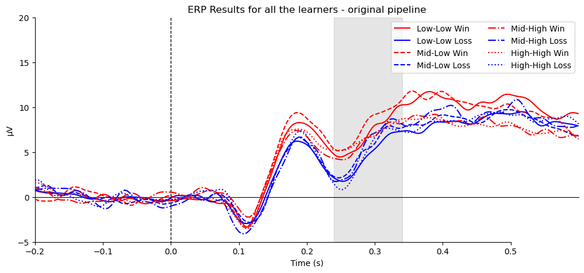
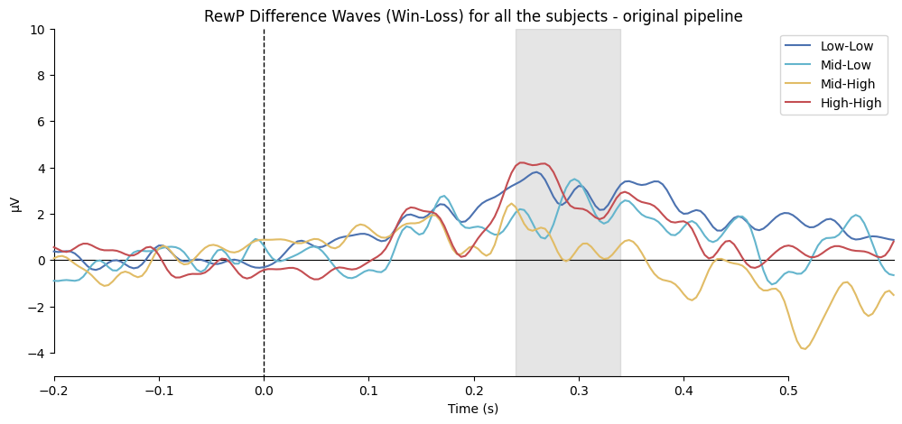
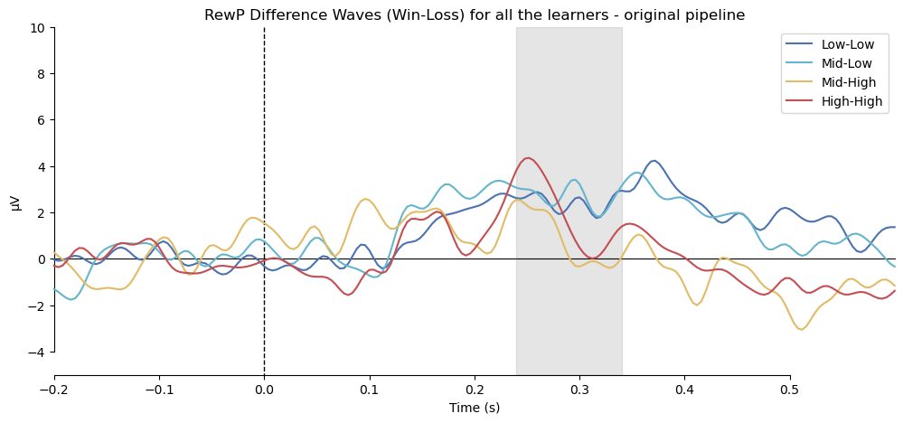
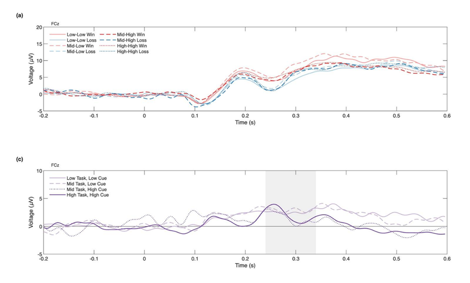

A critical divergence exists between our findings and the original study regarding the High-Task, High-Cue condition. While the theoretical background suggests that the RewP should reflect a combination of reward and expectancy, our results and the authors' results emphasize different aspects of this neural signal.

According to the Reward Prediction Error (RPE) theory, the RewP is not merely a measure of "how much" was won, but rather "how much better" the outcome was than expected. In the authors’ study, the High-High condition elicited a lower amplitude than the Mid-High condition. This is theoretically consistent with RL models: in a high-value task, the participant develops a high baseline expectation. When the reward occurs, it matches that expectation, resulting in a smaller prediction error and, consequently, a reduced RewP. The authors' results are more "reasonable" under the strict definition of the RewP as a violation of predictions. In contrast, our data showed a more linear relationship where higher task values led to higher RewP amplitudes.

To investigate the discrepancy between our findings and the original study's, we performed a verification process to ensure the integrity of our results: we replicated their pipeline in python (@fig-erp_all_concat), and also executed their original script in Matlab (@fig-rewp_erp_matlab_authors) to compare with our results. 

::: {#fig-erp_all_concat layout-ncol=2}

ERP and RewP Results by Author's Pipeline
:::

{#fig-rewp_erp_matlab_authors fig-align="center"}

The verification methods yielded results consistent with our proposed Python pipeline, and similar to the plot of our “only learners” scenario, showing that high-high condition gave higher values than mid-high condition. It confirms that our analytical approach is reliable and suggests that the difference is a result of sample size. Because our sample size was smaller, the subtle interaction of expectancy may not be caught and covered by the main effect of reward. Our results found out the Reward component of the RewP, showing that win elicits stronger signals than loss, whereas the authors' data captured subtle prediction error component.
