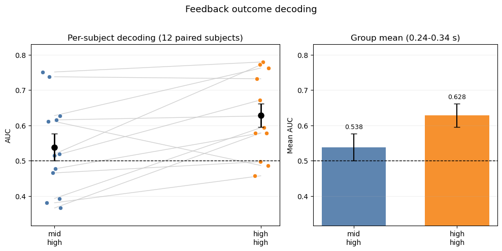
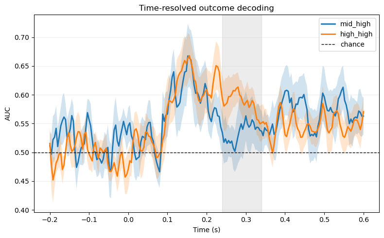
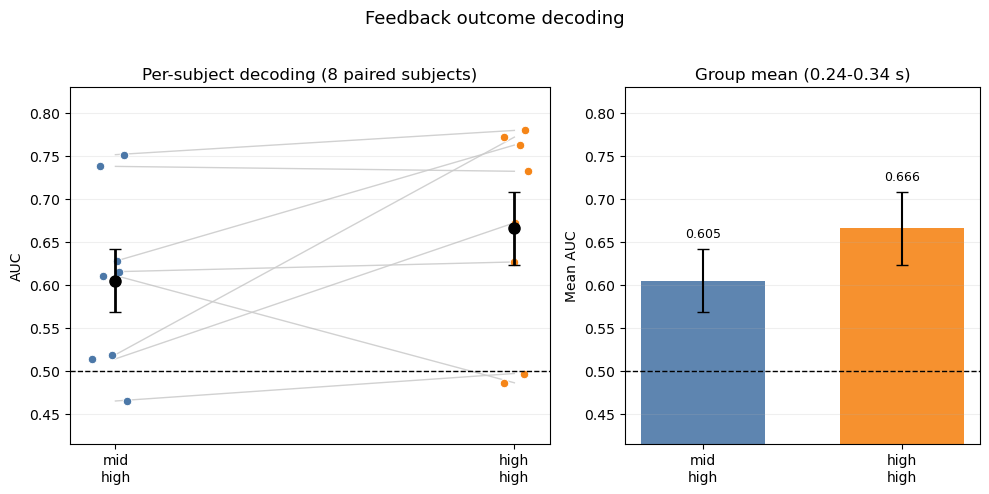
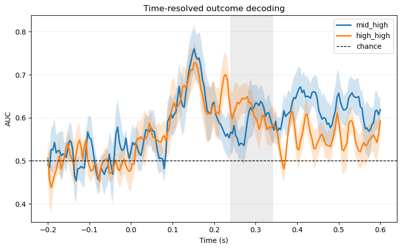

As an exploratory extension to the ERP analysis, we examined whether feedback outcome (win vs. loss) could be decoded from feedback-locked EEG in the mid-high and high-high contexts.
Decoding used epochs derived from the same preprocessing pipeline as the main ERP analysis. To ensure that each feedback epoch was matched to the correct behavioural label, early familiarization trials were not removed immediately. Instead, feedback epochs were first aligned with the behavioural table, and only then were early familiarization trials excluded. This procedure preserved trial-by-trial correspondence between epochs and behavioural context/outcome labels.

For the single-window analysis, decoding was performed on multichannel EEG data within the 240–340 ms interval, corresponding to the canonical RewP time window. Classification was implemented with logistic regression and cross-validation, and performance was quantified using ROC AUC, where chance level is 0.50. A complementary time-resolved analysis was also conducted to characterize when outcome information became decodable across the feedback epoch. Decoding is included here as an additional analysis alongside the main replication of the ERP results.

## Decoding Results
### All subjects results
In the full sample (`n=12`), mean AUC within the 240–340 ms window was 0.538 for the mid-high context and 0.628 for the high-high context (@fig-window_all), indicating above-chance decoding in both conditions and descriptively stronger decoding in the high-high context. 

{#fig-window_all fig-align="center"}

The time-resolved analysis showed that decoding rose above chance shortly after feedback onset and reached its strongest values around 0.13–0.18s (@fig-time_resolved_all), with the high-high context remaining descriptively higher across the predefined window. 

{#fig-time_resolved_all fig-align="center"}

### Learner-only results
A learner-only sensitivity analysis (`n=8`), howed a similar pattern. Mean AUC reached 0.605 in the mid-high context and 0.666 in the high-high context(@fig-window_learner), again indicating above-chance decoding in both conditions and descriptively stronger decoding in the high-high context. The time-resolved learner-only analysis showed a broadly similar temporal profile to that observed in the full sample(@fig-time_resolved_learner).

{#fig-window_learner fig-align="center"}

{#fig-time_resolved_learner fig-align="center"}

Overall, these decoding results suggest that feedback outcome information was present in EEG activity during, and slightly before, the RewP interval. Because the analyses were exploratory and based on a limited sample, they are interpreted as complementary to the main ERP findings.

