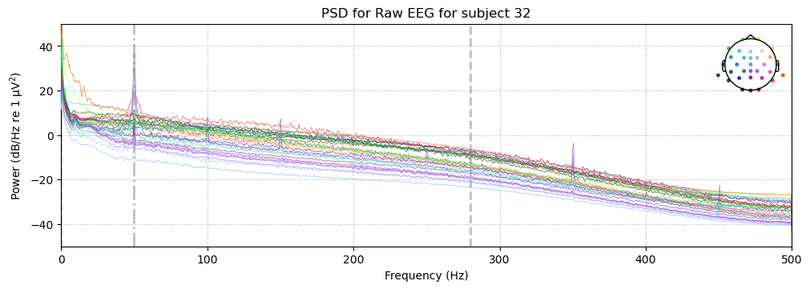
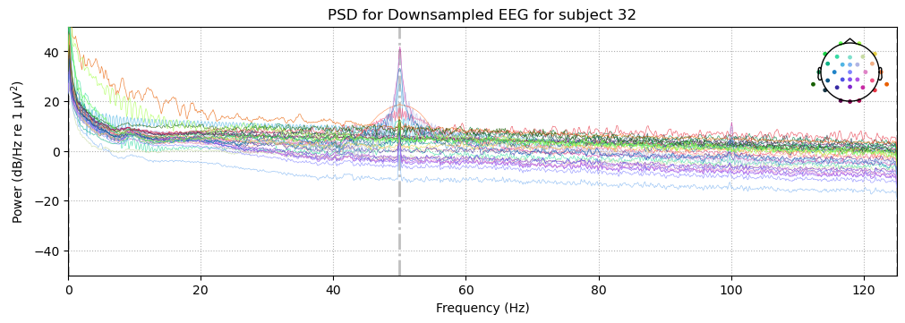
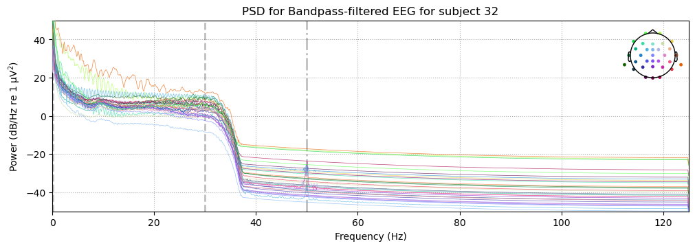
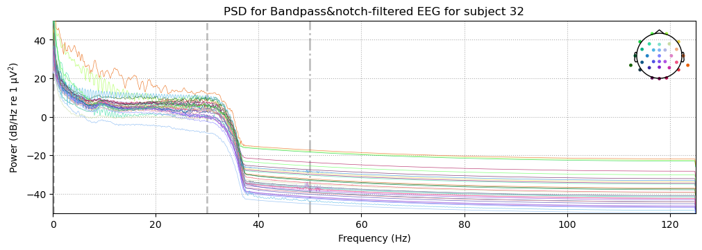
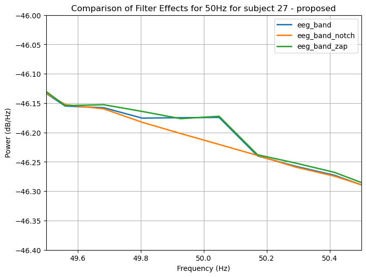
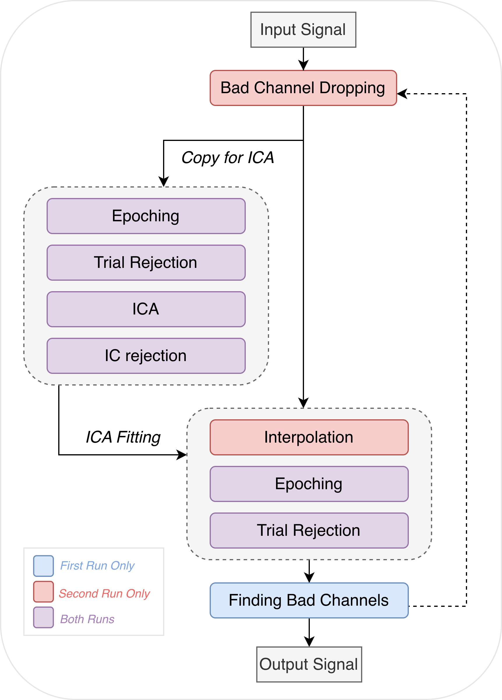
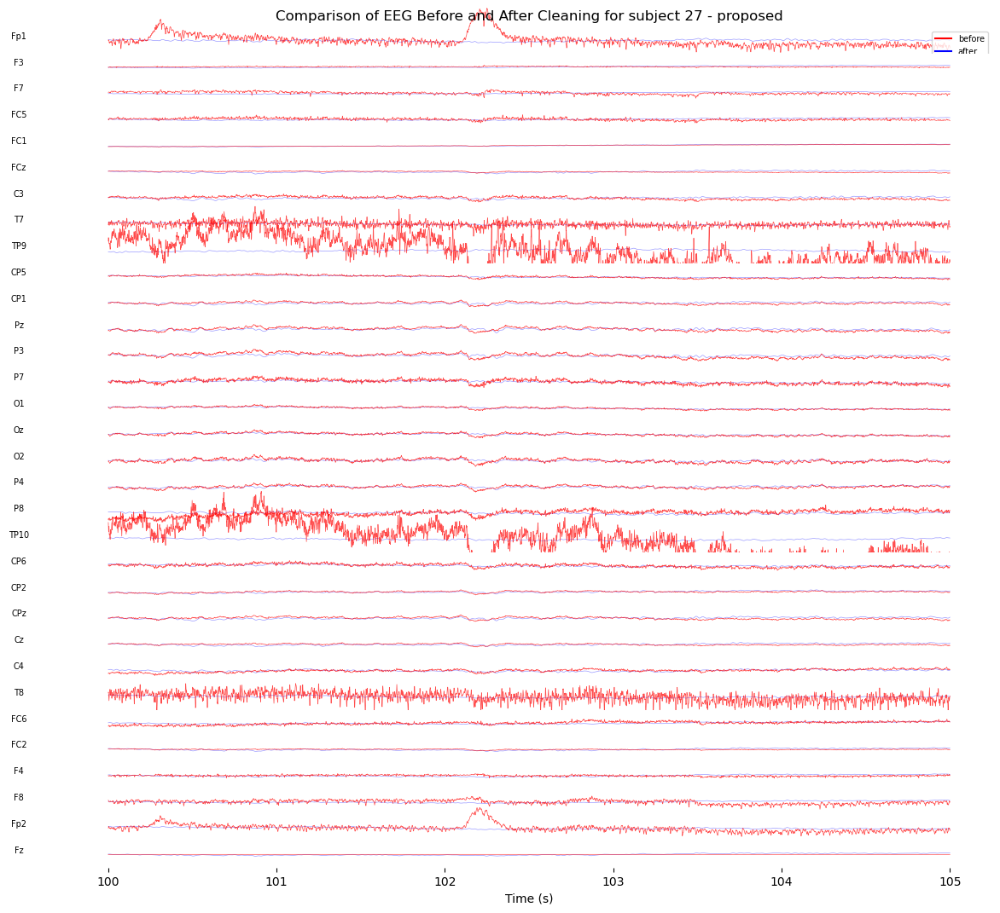
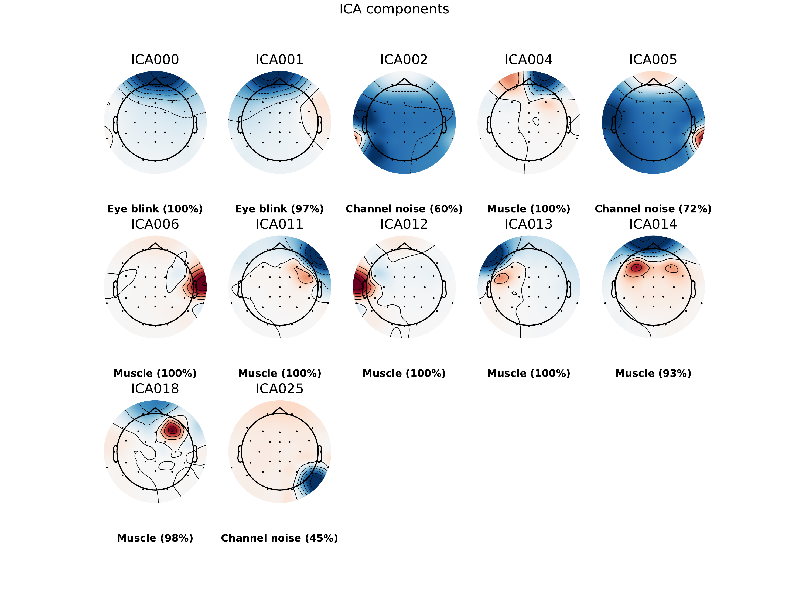
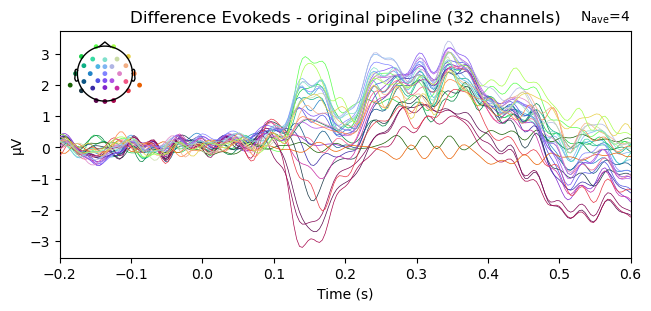
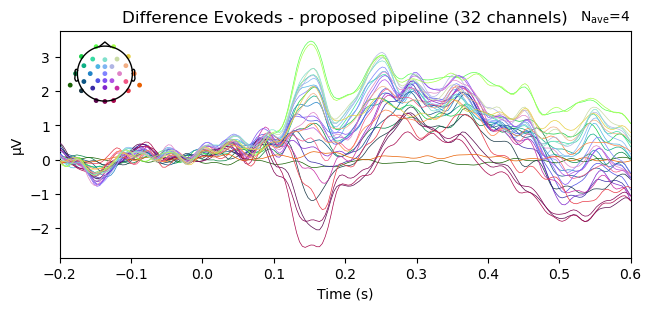

Even given the same EEG data, different pipelines could lead to very different results depending on the toolkit used, preprocessing steps, and type of analyses performed. For instance, if one pipeline deployed strict preprocessing steps to remove as much noise as possible while the other retained the original signal, they might yield very different ERPs and conclusions. Even though there are some generally agreed-upon steps in EEG signal processing, there is still considerable flexibility, with many caveats as each decision carrying its own advantages and disadvantages. One principle holds across this variability: results are more reliable and valid when they replicate across independent pipelines.

*Toolkit difference:* One key difference between the original pipeline, referred to as **Original**, and our proposed pipeline, referred to as **Proposed**, lies in the toolkit used: the former is implemented in EEGLAB for MATLAB, while the latter uses MNE-Python. To isolate the effect of this toolkit change from genuine methodological differences, we also replicated the original pipeline in MNE-Python, referred to as **Original-MNE**. Any discrepancy between Original and Original-MNE results can therefore be attributed to toolkit differences rather than processing decisions, while discrepancies between Original-MNE and Proposed reflect deliberate methodological changes. For completeness, we also ran the original EEGLAB script restricted to Oxford-site participants, which is not described here separately, as its steps are identical to those of Original.

*Learners vs. non-learners:* The Original pipeline included only 'learners' in the final ERP analysis — those who paid attention and learned, defined as participants who achieved a win rate \> 60% on high-value cues. We operated the pipelines on all subjects as well as the leaners only.

*Access to participant data:* The original study includes participants from two different sites, with 24 from the University of Victoria (UVic) and 12 from the University of Oxford (Oxford). Since we worked exclusively with data from the Oxford site, steps that map electrode locations across different recording caps to common locations were omitted.

## Pipeline Overview

+-------------------------------+--------------------------------------------------------------------------------------------+---------------------------------------------------+----------------------------------------+
| Step                          | Original                                                                                   | Proposed                                          | Original-MNE                           |
+:==============================+:===========================================================================================+:==================================================+:=======================================+
| **00: Reference channel**     | Fz reinserted                                                                              | —                                                 | —                                      |
+-------------------------------+--------------------------------------------------------------------------------------------+---------------------------------------------------+----------------------------------------+
| **00: Montage**               | site1/2.locs → common.locs                                                                 | site2.locs                                        | site2.locs                             |
+-------------------------------+--------------------------------------------------------------------------------------------+---------------------------------------------------+----------------------------------------+
| **00: Re-referencing**        | Linked mastoids (T9, T10)                                                                  | —                                                 | —                                      |
+-------------------------------+--------------------------------------------------------------------------------------------+---------------------------------------------------+----------------------------------------+
| **01: Downsampling**          | 1000 Hz → 250 Hz                                                                           | —                                                 | —                                      |
+-------------------------------+--------------------------------------------------------------------------------------------+---------------------------------------------------+----------------------------------------+
| **01: Band-pass filter**      | 0.1–30 Hz                                                                                  | —                                                 | —                                      |
+-------------------------------+--------------------------------------------------------------------------------------------+---------------------------------------------------+----------------------------------------+
| **01: Line noise removal**    | Notch at 50/60 Hz                                                                          | Notch at 50 Hz                                    | Notch at 50 Hz                         |
+-------------------------------+--------------------------------------------------------------------------------------------+---------------------------------------------------+----------------------------------------+
| **02: Channel rejection**     | Automatic, iterative (\>20% epoch loss)                                                    | —                                                 | —                                      |
+-------------------------------+--------------------------------------------------------------------------------------------+---------------------------------------------------+----------------------------------------+
| **03/07: Trial rejection**    | For ICA: Peak-to-peak (500 µV); absolute (500 µV); gradient (40 µV); minimum (0.1 µV)      | For ICA: Absolute (500 µV); minimum (0.1 µV)      | —                                      |
|                               |                                                                                            |                                                   |                                        |
|                               | For main EEG: peak-to-peak (150 µV); absolute (150 µV); gradient (40 µV); minimum (0.1 µV) | For main EEG: Absolute (150 µV); minimum (0.1 µV) |                                        |
+-------------------------------+--------------------------------------------------------------------------------------------+---------------------------------------------------+----------------------------------------+
| **04: ICA algorithm**         | Runica                                                                                     | Picard                                            | Infomax (extended)                     |
+-------------------------------+--------------------------------------------------------------------------------------------+---------------------------------------------------+----------------------------------------+
| **04: IC rejection**          | ICLabel; P(eye) \> P(brain)                                                                | ICLabel on 1–100 Hz copy; P(brain) \< 40%         | —                                      |
+-------------------------------+--------------------------------------------------------------------------------------------+---------------------------------------------------+----------------------------------------+
| **05: Interpolation**         | Spherical spline                                                                           | —                                                 | —                                      |
+-------------------------------+--------------------------------------------------------------------------------------------+---------------------------------------------------+----------------------------------------+
| **06: Early trial removal**   | First 10 trials per task                                                                   | —                                                 | —                                      |
+-------------------------------+--------------------------------------------------------------------------------------------+---------------------------------------------------+----------------------------------------+
| **09: Trial-level averaging** | Mean                                                                                       | 5% trimmed mean                                   | —                                      |
+-------------------------------+--------------------------------------------------------------------------------------------+---------------------------------------------------+----------------------------------------+
| **10: ERP quantification**    | Peak amplitude (240–340 ms, FCz)                                                           | Peak, mean, and peak-to-peak amplitude            | Peak, mean, and peak-to-peak amplitude |
+-------------------------------+--------------------------------------------------------------------------------------------+---------------------------------------------------+----------------------------------------+
| **11: Statistics**            | Paired t-test (RewP); one-way ANOVA + t-test (behavioral)                                  | \+ permutation t-test (RewP)                      | \+ permutation t-test (RewP)           |
+-------------------------------+--------------------------------------------------------------------------------------------+---------------------------------------------------+----------------------------------------+
| **12: Further Analysis**      |                                                                                            | Decoding; Cross-time analysis                     |                                        |
+-------------------------------+--------------------------------------------------------------------------------------------+---------------------------------------------------+----------------------------------------+

: Pipeline comparison across preprocessing approaches. {#tbl-pipeline}

::: callout-tip
Notes:

1.  "—" in the Proposed and Original-MNE columns indicates the step follows Original unless otherwise specified. Differences between Original and Original-MNE reflect toolkit constraints; differences between Original-MNE and Proposed reflect deliberate methodological choices.
2.  Infomax in MNE is equivalent to Runica in EEGLAB [@EEGLAB_ICA]. The extended variant was used as recommended by an MNE warning, though it is unclear whether this matches the version used in Original.
3.  ICLabel is implemented slightly differently between EEGLAB and MNE: 'eye blinks' and 'eye movements' are listed as separate categories in MNE but aggregated as 'eye' in EEGLAB.
:::

## Steps 00–06: Preprocessing

### Step 00: Adding Reference Channel, Setting Montage, and Re-referencing

*Refer to: `s00_add_reference.py`*

**Purpose** Raw EEG data is recorded relative to one or more reference electrode(s). Before any preprocessing, the electrode layout (montage) must be established so that MNE can interpret the spatial relationships between channels, which is required for later steps such as ICA, interpolation, and topographic visualization. Because the reference channel is recorded as all zeros and may not be stored in the raw data file, it must be reinserted manually before re-referencing can be applied. Re-referencing is standard practice in EEG signal processing, as the online reference may not be optimal for subsequent analysis.

**Original Pipeline** For the Oxford site, the channel 'Fz' is reinserted as the reference channel, yielding 32 channels in total. Original used the montage stored in `site1channellocations.locs` for the UVic site and `site2channellocations.locs` for the Oxford site. Because different recording caps were used at the two sites, signals were subsequently remapped to `common.locs` with channels added or removed accordingly. Original used linked mastoids (channels T9 and T10) for re-referencing, as mastoid positions are assumed to pick up little neural signal. If either T9 or T10 was rejected during channel dropping, only the remaining electrode was used as the reference.

**Proposed Pipeline** We followed the same reference channel and montage scheme as Original. Since we work exclusively with Oxford-site data, the cross-site remapping step is not required and has been omitted. The choice of mastoid referencing is not well motivated here and will be discussed further in the limitations section.

::: callout-caution
Re-referencing occurs after bad-channel dropping in Original, and consequently in Proposed as well. As we think this ordering is arbitrary for linked-mastoid referencing, it is described here for organizational clarity.
:::

------------------------------------------------------------------------

### Step 01: Downsampling and Filtering

*Refer to: `s01_downsample_filter.py`*

**Purpose** Raw EEG is sampled at a high frequency during recording, 1000 Hz in our case, which exceeds what is needed to resolve the neural signals of interest. Downsampling reduces memory and computation demands for all subsequent steps, while band-pass filtering confines the signal to the frequency range of interest and removes low- and high-frequency noise that would otherwise obscure the component.

**Original Pipeline** Original downsampled from 1000 Hz to 250 Hz, then applied a 0.1–30 Hz band-pass filter, followed by a notch filter at 50 Hz (Oxford site) or 60 Hz (UVic site) to suppress electrical line noise.

**Proposed Pipeline** We adopted the same parameters. A target rate of 250 Hz is well-suited to the analysis: it meaningfully reduces data size and satisfies the Nyquist criterion for the 30 Hz bandpass upper bound. MNE's `.resample()` applies an anti-aliasing low-pass filter at 125 Hz automatically prior to downsampling, which serves the same purpose as the equivalent EEGLAB step and ensures no aliasing artifacts are introduced.

A lower bound of 0.1 Hz is a well-established threshold suitable for attenuating slow drifts while preserving statistical power and minimising filter-induced artifacts [@Tanner2015]. We retained 30 Hz as the upper bandpass bound rather than the more commonly used 40 Hz, following the original authors, as we thought RewP should fall well below this threshold.

Since we have access only to Oxford-site data, the notch filter is uniformly set to 50 Hz.

*Ordering of downsampling and band-pass filtering:* We downsampled before applying the band-pass filter, matching Original. Applying multiple sequential filters in principle risks introducing more ringing artifacts. In practice, however, the 125 Hz anti-aliasing filter applied at downsampling is sufficiently far from the 30 Hz bandpass boundary that any interaction is negligible, so the ordering does not produce a meaningful difference here.

*Line noise filter choice:* We evaluated both a notch filter and a ZapLine filter and retained the notch filter. ZapLine was slower and left visible residual artifacts in some cases (@fig-zap_notch). The necessity of any line-noise removal step after a 30 Hz bandpass is not self-evident, as 50 Hz lies well above the passband. However, we observed residual 50 Hz contamination in the power spectrum of several subjects after bandpass filtering alone (@fig-subject32-linenoise), consistent with sub-harmonic leakage. The notch filter reliably resolved this, as shown in (@fig-subject32-no-linenoise).

::: callout-note
### Sanity Check — Filtering

{#fig-subject32-raw}

{#fig-subject32-down}

{#fig-subject32-linenoise}

{#fig-subject32-no-linenoise}

{#fig-zap_notch width="70%"}

### To reproduce the plots

```yaml         
With <single_subject_processing.ipynb> open:
    Set:
        SUBJECT: 32
        INSPECTION_MODE: TRUE
    Navigate to:
        Section — Examine Results of Filtering
```
:::

------------------------------------------------------------------------

### Step 02: Channel Rejection

*Refer to: `s02_drop_bad_channels.py`, `s08_find_bad_channels.py`*

**Purpose** Channels with poor signal quality due to, e.g., electrode displacement, high impedance, or persistent noise, can contaminate neighbouring channels and degrade ICA decomposition, and are therefore unacceptable even if they are not the direct target of analysis. Identifying and removing them before further processing prevents these artifacts from propagating through the pipeline.

**Original Pipeline** Rather than applying a fixed threshold or relying on manual inspection, Original uses an iterative two-loop structure. Bad channels are not identified upfront. Instead, after the first pass of ICA component rejection, any channel responsible for more than 20% of epoch rejections is flagged as bad and removed in the second loop. This defers the channel rejection decision until after the data-driven artifact cleaning stage, allowing the criterion to be based on observed trial-loss impact rather than signal statistics alone. The loop logic is illustrated in @fig-channel_logistics.

**Proposed Pipeline** We adopted the same loop structure and threshold. The iterative approach is preferable to manual inspection for reproducibility, and the 20% epoch-loss criterion provides a principled, data-driven basis for dropping channels rather than relying on subjective visual judgment.

{#fig-channel_logistics width="50%"}

------------------------------------------------------------------------

### Step 03: Epoch Rejection

*Refer to: `s03_07_trial_rejection.py`*

**Purpose** Even after channel-level rejection and ICA component removal, individual epochs may contain transient artifacts that would distort the averaged ERP if retained. Epoch rejection identifies and discards these trials before averaging.

**Original Pipeline** Trial rejection is applied at two points in the pipeline: once to the data used for ICA training (Step 03), and again after all preprocessing steps are complete (Step 07). In each pass, four criteria are applied to every epoch: a peak-to-peak amplitude threshold (500 µV for ICA; 150µV for ERP epochs), an absolute amplitude threshold (500 µV for ICA; 150µV for ERP epochs), a sample-to-sample gradient threshold (40 µV), and a minimum amplitude threshold (0.1 µV). An epoch failing any single criterion is rejected.

**Proposed Pipeline** MNE's epoch rejection supports an absolute amplitude threshold and a minimum amplitude threshold, corresponding to the absolute and minimum criteria from Original. We applied these two criteria and omitted the peak-to-peak and gradient thresholds, accepting the trade-off between artifact sensitivity and implementation simplicity. Parameter values from Original are retained where criteria overlap. A practical benefit of MNE's native rejection is that the full rejection log is accessible via `.drop_log`, making it straightforward to audit which trials were removed and why.

::: callout-caution
The epoch rejection applied to the main EEG signal is performed in Step 07, after epoching. It is described here for organizational clarity.
:::

------------------------------------------------------------------------

### Step 04: ICA

*Refer to: `s04_ICA.py`*

**Purpose** Independent component analysis (ICA) decomposes the multichannel EEG signal into statistically independent sources. Components corresponding to non-neural artifacts, such as eye blinks and heartbeat, can then be identified and removed before further analysis, without discarding entire trials or channels.

**Original Pipeline** Original runs Runica on epoched data time-locked to cue onset, preventing ICA from being driven by large transient distortions. Components are labelled using ICLabel in EEGLAB, and any component more likely to be eye-related than brain-related (P(eye) \> P(brain)) is removed from the continuous EEG signal.

**Proposed Pipeline** As in Original, we epoched `eeg_ICA` for ICA training and rejected epochs with excessive artifacts before decomposition, using the criteria described in Step 03. We used Picard rather than Runica <!-- TODO: add reasoning, e.g. convergence speed, numerical stability -->. We applied ICLabel for component classification.

The key structural difference from Original is that rather than running ICA on the fully preprocessed signal, we created a separate copy of the data after downsampling (referred to as `eeg_ICA`) and applied a 1–100 Hz band-pass filter to this copy before ICA decomposition. A 1 Hz high-pass is recommended for ICA, as low-frequency drifts can distort the decomposition [@MNE_ICA]. Additionally, as ICLabel's classifier was trained on data filtered to this range <!-- TODO: add ICLabel training citation -->, applying it to data filtered outside this range may reduce labelling accuracy. The ICA weights learned from `eeg_ICA` are then transferred to the main preprocessed signal.

Manual inspection revealed that artifacts including heartbeat <!-- TODO: specify additional artifact types --> remained after applying Original's rejection criterion, so we adopted a stricter threshold: components are excluded if their estimated probability of reflecting brain activity falls below 40%. This resulted in a substantially larger number of rejected components in Proposed compared to Original-MNE, as shown in @fig-ica_comp.

```{python}
#| label: fig-ica-comp
#| fig-cap: "Per-subject IC rejection count by pipeline. Dashed lines show group means."
#| echo: false

import sys
import matplotlib.pyplot as plt
import matplotlib.patches as mpatches
import numpy as np

sys.path.insert(0, '../scripts')
from config import SUBJECT_INFO

N_COMPONENTS = 31

subjects = sorted(SUBJECT_INFO.keys(), key=lambda x: int(x))
orig_counts = [len(SUBJECT_INFO[s]['ic_excluded']['original']) for s in subjects]
prop_counts = [len(SUBJECT_INFO[s]['ic_excluded']['proposed']) for s in subjects]

x = np.arange(len(subjects))
width = 0.35

mean_orig = np.mean(orig_counts)
mean_prop = np.mean(prop_counts)

fig, ax = plt.subplots(figsize=(12, 5))

ax.bar(x - width/2, orig_counts, width, color='#5B9BD5', label='Original')
ax.bar(x + width/2, prop_counts, width, color='#C0504D', label='Proposed')

ax.axhline(mean_orig, color='#5B9BD5', linestyle='--', linewidth=1.2,
           label=f'Original mean ({mean_orig:.1f})')
ax.axhline(mean_prop, color='#C0504D', linestyle='--', linewidth=1.2,
           label=f'Proposed mean ({mean_prop:.1f})')

ax.set_xticks(x)
ax.set_xticklabels([f'S{s}' for s in subjects])
ax.set_ylabel('ICs removed')
ax.set_title('Per-subject IC rejection count')
ax.legend(loc='upper left', framealpha=0.9)
ax.set_ylim(0, N_COMPONENTS + 2)
ax.spines['top'].set_visible(False)
ax.spines['right'].set_visible(False)
ax.yaxis.grid(True, linestyle='--', alpha=0.5)
ax.set_axisbelow(True)

plt.tight_layout()
plt.show()
```

------------------------------------------------------------------------

### Step 05: Interpolation

*Refer to: `s05_interpolation.py`*

**Purpose** If one or more channels have been marked as bad and removed, the electrode locations they occupied are left empty. Interpolation reconstructs the missing channel signals from surrounding electrodes, restoring a complete channel set for subsequent analyses that depend on spatial completeness.

**Original Pipeline** Original used the default spherical interpolation method [@EEGLAB_interp].

**Proposed Pipeline** We used MNE's default interpolation method, which is spherical spline [@MNE_interp], consistent with Original. We note that this choice was not deliberate as we were not aware of alternatives.

::: callout-note
### Sanity Check — Cleaning Inspection for Subject 27 (trial rejection not shown)

{#fig-cleaning}

{#fig-iccomponent-27-prop}

As shown in @fig-cleaning, suspected artifacts from eye blinks (Fp1, Fp2), channel noise (TP9, TP10), and muscle activity (T7, T8), as identified by ICLabel (@fig-iccomponent-27-prop), are largely attenuated after cleaning.
:::

------------------------------------------------------------------------

### Step 06: Early Trial Removal

*Refer to: `s06_early_trial_removal.py`*

**Purpose** At the start of each casino block, participants encountered a new set of slot machine cues for the first time. Early trials reflect initial familiarisation rather than stable cue–outcome learning, and including them would conflate learning-onset effects with the trained response patterns of interest.

**Original Pipeline** Original removes the first ten trials of each casino block to allow participants time to familiarise themselves with the new cue set.

**Proposed Pipeline** We retain the ten-trial cutoff. Given that each casino contains six distinct slot machines, the first ten trials provide only one to two exposures per cue, which is arguably insufficient to establish stable response tendencies before the removed trials end. A larger cutoff would be preferable from a signal quality standpoint, but given that we are working with less than half the original sample, further reducing trial counts risks leaving the analysis underpowered. We therefore follow the original authors' decision as a deliberate compromise between data quality and quantity.

------------------------------------------------------------------------

## Steps 07 & 09: Making ERPs

*Refer to: `s07_epoching.py`, `s03_07_trial_rejection.py`, `s09_make_erps.py`*

**Purpose** ERPs are constructed by segmenting the continuous EEG into short epochs time-locked to events of interest, then averaging across trials within each condition. Averaging attenuates stochastic neural activity, leaving the stimulus-locked component that is consistent across trials.

**Original Pipeline** Original constructs 800 ms epochs (−200 to +600 ms relative to event onset) for feedback-locked analysis, with a 200 ms pre-stimulus baseline correction. Epochs are averaged within conditions to produce eight ERPs: Low-Low Win, Low-Low Loss, Mid-Low Win, Mid-Low Loss, Mid-High Win, Mid-High Loss, High-High Win, and High-High Loss. Win–loss difference waves are then computed within each of the four task × cue conditions, yielding the difference ERPs used for RewP quantification.

**Proposed Pipeline** We used the same epoch boundaries, baseline correction window, and difference-wave procedure. Rather than computing a simple mean across trials, however, we used a 5% trimmed mean, excluding the most extreme 5% of trials at each tail before averaging. With roughly half the original sample available, the arithmetic mean is more susceptible to distortion by individual outlier trials, while the trimmed mean may reduce this sensitivity and improve the robustness of the condition averages.

::: callout-note
## Sanity Check — Butterfly Plots

{#fig-butterfly-ori}

{#fig-butterfly-prop}

As shown in @fig-butterfly-ori and @fig-butterfly-prop, all evokeds converge near zero in the baseline window (−200 to 0 ms) and diverge only after stimulus onset, confirming that baseline correction functioned correctly in both pipelines. <!-- TODO: add further observations if needed -->
:::

------------------------------------------------------------------------

## Step 10: RewP Calculation

*Refer to: `s10_rewp_calculation.py`*

**Purpose** The reward positivity (RewP) is a positive-going ERP thought to index a reward prediction error signal generated in anterior cingulate cortex and is the primary dependent variable of the present analysis.

**Original Pipeline** Original quantifies the RewP as the peak voltage within the 240–340 ms window at channel FCz, taken from the win–loss difference ERPs, following the recommendations of @SambrookGoslin2015.

**Proposed Pipeline** We compute the RewP using three methods — peak amplitude (as in Original), mean amplitude, and peak-to-peak amplitude, which captures the full deflection relative to the preceding negativity — to assess whether the choice of quantification approach affects the pattern of results. Following Original, we compute difference waves by subtracting the loss ERP from the win ERP within each condition, thereby minimising component overlap and allowing amplitude differences to be attributed to the RewP.

------------------------------------------------------------------------

## Step 11: Statistical Analysis

*Refer to: `behavior_task_value`, `stats.rewp_sccores.py`, `stats.inerence_parametric.py`, `stats.inference_permutation_test.py`*

**Purpose** Statistical analysis provides a systematic framework for interpreting the derived results, allowing us to assess the direction and magnitude of condition differences and to evaluate whether conclusions are reliable given the available sample size.


**Original Pipeline** Inferential statistics in the original study were conducted on the main learner sample. For the behavioural data, the mean proportion of winning trials across the low-, mid-, and high-value tasks was analysed using a one-way repeated-measures ANOVA, and effect sizes were reported as partial and generalized eta-squared. In addition, mean performance was compared between the mid- and high-value tasks using a paired-samples t-test, where performance was defined as the proportion of correct responses to high-value cues.


For the Rewp analysis, the original study used paired-samples t-tests on RewP scores. To avoid confounding task-value effects with differences in outcome frequency, only conditions with matched outcome frequencies were compared: (Low-Low vs Mid-Low), and (Mid-High vs High-High). Cohen’s d for paired-samples t-tests was also reported. For all t-tests, the authors assessed normality using the Shapiro–Wilk test on each variable separately rather than on paired difference scores, and no correction was applied when non-normality was observed because the t-test was considered sufficiently robust.


**Proposed Pipeline**  
We retained the original inferential structure but adapted it to our reduced sample size. Specifically, we reproduced the behavioural ANOVA and paired t-test, as well as the two planned RewP comparisons. Because only 12 participants were available, including 8 learners, we additionally analysed the full sample as a sensitivity analysis. We also evaluated Shapiro–Wilk normality on paired difference scores rather than on each variable separately, as this is more directly aligned with the assumptions of the paired t-test. Finally, we supplemented the paired t-tests with exact paired permutation tests to provide a non-parametric robustness check.

